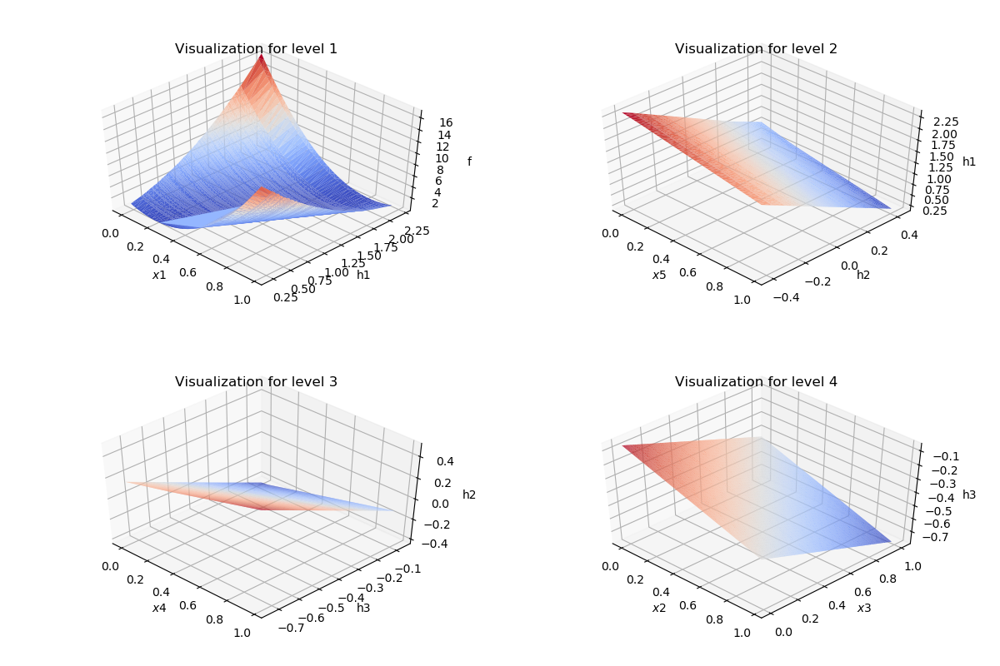
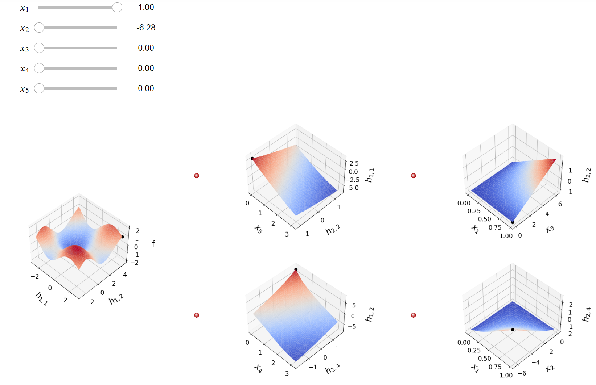

# IANN
This is a black-box function visualization package for Interpretable Architecture Neural Network (IANN)[1]

The basic idea of IANN is to approximate the black-box function $f$ by

$$f(\mathbf{x}) = g(x_j, h(x_{\setminus{j}})),$$

for some input $x_j$, and two continuous functions $g$ and $h$. To visualize the effect of $x_j$, one can construct a 3D plot with $f$ vs. $x_j$ and $h$. Then, the IANN proceeds in a hierarchical way to further approximate $h$ with a similar structure.

It has two specific structure, each of which can be efficiently represented by IANN, OVH and DASH.   

**Original Variable Hierarchical (OVH):** visualize the effects of the original variables on the response $f$.   
  

**Disjoint Active Subspace Hierarchical (DASH):** construct groups of disjoint linear combinations of the inputs and visualize the effects on $f$ with the groups as the inputs.  

[1] Zhang, Shengtong, and Daniel W. Apley. "Interpretable Architecture Neural Networks for Function Visualization." Journal of Computational and Graphical Statistics just-accepted (2023): 1-21.

# BIANN
This is a generalized version of IANN with a balanced split in the dichtomous tree structure, called Balanecd Interpretable Architecture Neural Network (BIANN).

The main idea is to approximat the black-box function $f$ by
$$f(\mathbf{x}) = g(h_1(x_{J_1}), h_2(x_{J_2})),$$
for some subset of inputs $x_{J_1}$ and $x_{J_2}$. To better facilitate visualization, our algorithms automatically finds $x_{J_1}$ and $x_{J_2}$ that have balanced number of inputs and are encouraged to be disjoint with each other. 

We also incorporate a User Interface so that users can interact with the BIANN visualization plots and directly observe the effects of the inputs on the plots. See this [Jupyter Notebook](./BIANN/interface/plane_wave.ipynb)
  
